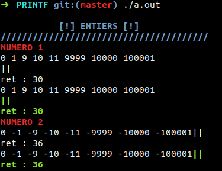
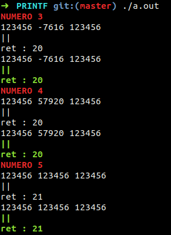

# PRINTF

This project is about to recreate the function printf and learn to use variadic arguments.
> Mandatory part : 
* manage any combination of the following conversions : cspdiuxX%
* manage any combination of the following flags : -0.*
* and minimum field width with all conversions
> Bonus part :
* conversions : n
* flags : l ll h hh

# Building Mandatory part

``$> git clone https://github.com/lilafallet/PRINTF_42.git ``

``$> cd PRINTF_42``

``$> make``

``$> clang -Wall -Wextra main/main.c -I./includes -I./libft/ -L. -lftprintf``

``$> ./a.out``

> Testing :
* First line and first ret : real printf function
* Second line and second ret : my printf

# Building Bonus part

``$> git clone https://github.com/lilafallet/PRINTF_42.git ``

``$> cd PRINTF_42``

``$> make``

``$> clang -Wall -Wextra main/main_bonus.c -I./includes_bonus -I./libft/ -L. -lftprintf``

``$> ./a.out``

> Testing :
* First line and first ret : real printf function
* Second line and second ret : my printf

